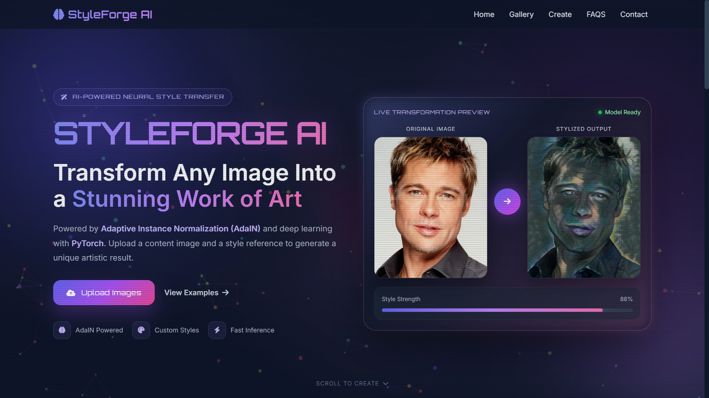
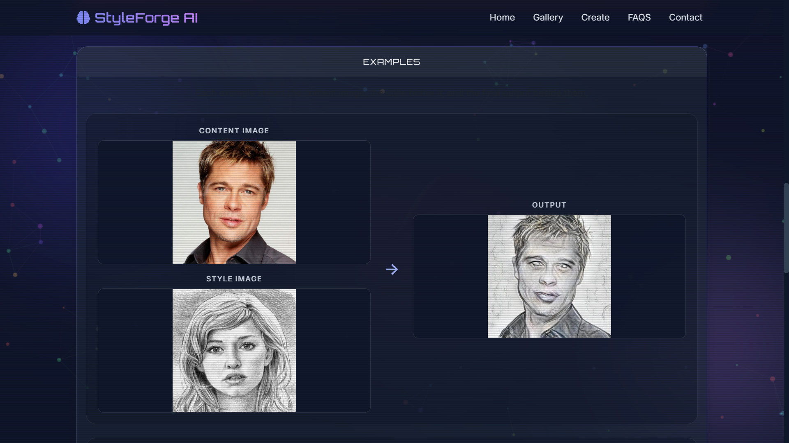

# 🎨 StyleForge AI

**StyleForge AI** is an AI-powered Neural Style Transfer web application built with **Flask** and **PyTorch**. It uses **Adaptive Instance Normalization (AdaIN)** to blend the artistic style of one image with the structural content of another, producing high-quality stylized artwork in just a few seconds.

The application provides an intuitive web interface where users can upload a **content image** and a **style reference image**, adjust the style strength, and generate a unique artistic output.

---

## ✨ Features

- 🖼️ Upload content and style images
- 🎨 AI-powered Neural Style Transfer using AdaIN
- 🎛️ Adjustable style strength slider
- ⚡ Fast inference with PyTorch
- 🖥️ Interactive Flask web interface
- 📥 Download generated stylized images
- 🖼️ Built-in example gallery
- 📱 Responsive modern UI
- 🧠 VGG Encoder + Trained Decoder architecture

---

## 🚀 Demo

### Input

- **Content Image**
- **Style Reference**

↓

### AI Processing

- VGG Encoder
- Adaptive Instance Normalization (AdaIN)
- Decoder Network

↓

### Output

- Stylized AI Artwork

---

## 🛠️ Tech Stack

### Backend

- Python
- Flask
- PyTorch
- Torchvision

### Frontend

- HTML5
- CSS3
- Bootstrap 5
- JavaScript

### Libraries

- Pillow
- Flask-WTF
- WTForms

---

# 📂 Project Structure

```text
StyleForge-AI/
│
├── README.md
├── requirements.txt
├── Procfile.txt
├── code.ipynb
│
├── Demo_IO_Images/
│   ├── i-p/
│   └── o-p/
│
└── NST_Code/
    ├── app.py
    ├── train.py
    ├── vgg_normalised.pth
    ├── adain_algo.png
    │
    ├── content_data/
    ├── style_data/
    ├── examples/
    ├── static/
    │   └── uploads/
    │
    ├── templates/
    │   └── index.html
    │
    ├── experiment/
    │   └── final_exp/
    │       ├── decoder_final.pth
    │       └── sample_iter_*.png
    │
    └── utils/
        ├── models.py
        └── utils.py
```

---

# ⚙️ Installation

## 1️⃣ Clone Repository

```bash
git clone https://github.com/yourusername/StyleForge-AI.git

cd StyleForge-AI
```

---

## 2️⃣ Create Virtual Environment

### Windows

```powershell
python -m venv .venv

.\.venv\Scripts\activate
```

If activation is blocked:

```powershell
Set-ExecutionPolicy -Scope Process -ExecutionPolicy Bypass

.\.venv\Scripts\activate
```

---

## 3️⃣ Install Dependencies

```bash
pip install --upgrade pip

pip install -r requirements.txt
```

---

# ▶️ Run The Application

```bash
python NST_Code/app.py
```

Open your browser:

```
http://localhost:5000
```

---

# 🎯 How It Works

### Step 1

Upload a **Content Image**

↓

### Step 2

Upload a **Style Image**

↓

### Step 3

Adjust the **Style Strength**

↓

### Step 4

Click **Transfer Style**

↓

### Step 5

Download the generated artwork

---

# 🧠 Model Pipeline

```text
Content Image
       │
       ▼
   VGG Encoder
       │
       ▼
Content Features

Style Image
       │
       ▼
   VGG Encoder
       │
       ▼
 Style Features

       │
       ▼
Adaptive Instance Normalization (AdaIN)

       │
       ▼
 Stylized Features

       │
       ▼
 Decoder Network

       │
       ▼
 Generated Artwork
```

---

# 🧩 Core AdaIN Function

```python
adaptive_instance_normalization(content_feat, style_feat)
```

AdaIN transfers the statistical properties (mean and standard deviation) of the style features to the content features, enabling artistic style transfer while preserving the original image structure.

---

# 🏋️ Train the Model (Optional)

Training script:

```bash
cd NST_Code

python train.py \
--content_dir content_data \
--style_dir style_data \
--vgg vgg_normalised.pth \
--experiment my_exp \
--epochs 10
```

> **Note:** GPU is recommended for training.

---

# 📸 Screenshots

## Home Page

<p align="center">

</p>

---

## Generated Result

<p align="center">

</p>

---

# 📁 Important Files

| File | Description |
|------|-------------|
| `app.py` | Flask routes and inference pipeline |
| `train.py` | Model training script |
| `models.py` | VGG Encoder and Decoder architecture |
| `utils.py` | AdaIN implementation and utilities |
| `index.html` | Frontend interface |
| `requirements.txt` | Project dependencies |

---

# ⚠️ Common Issues

### Python not recognized

Install Python and enable

```
Add Python to PATH
```

Verify installation

```bash
python --version
```

---

### Model file not found

Ensure the following files exist:

```
NST_Code/vgg_normalised.pth

NST_Code/experiment/final_exp/decoder_final.pth
```

---

### Virtual Environment Error

```powershell
Set-ExecutionPolicy -Scope Process -ExecutionPolicy Bypass
```

---

### PyTorch Version Issue

```bash
pip install --upgrade -r requirements.txt
```

---

# 📌 Notes

- Supports **JPG**, **JPEG**, and **PNG**
- Generated images are stored inside:

```
NST_Code/static/uploads/
```

- First inference may take a few seconds because model weights are loaded.
- CUDA GPU is recommended for faster inference.

---

# 🔮 Future Improvements

- 🎭 Multiple built-in artistic styles
- ⚡ Real-time style preview
- 📱 Drag & Drop image upload
- 🖼️ Batch image stylization
- ☁️ Cloud deployment
- 📊 Image comparison slider
- 🧠 More advanced style transfer models

---

# 🙌 Acknowledgements

This project is inspired by the research on **Arbitrary Style Transfer using Adaptive Instance Normalization (AdaIN)** and is built using **PyTorch**, **Flask**, and **VGG-based feature extraction**.

---

# 👨‍💻 Author

**Sumit Jaiswal**

💻 Passionate about AI, Machine Learning, Computer Vision, and Full-Stack Development.

---

## ⭐ If you found this project useful, consider giving it a Star!